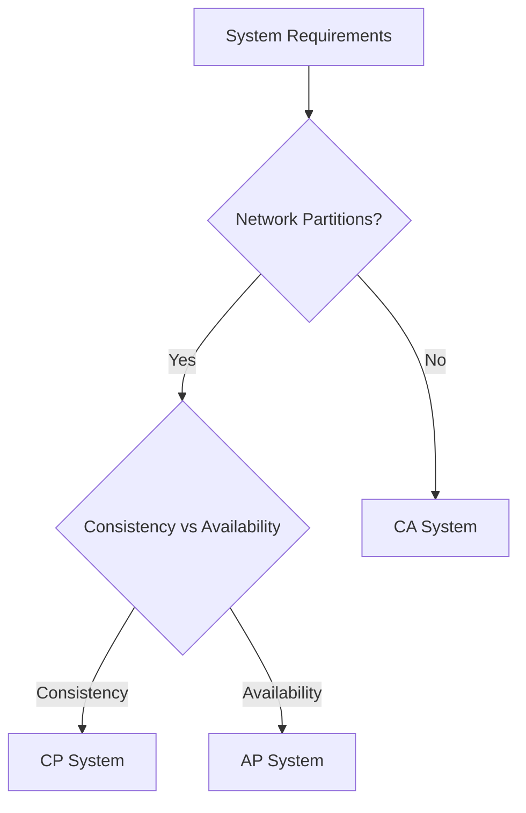

# System Design Concepts and Patterns

## 1. Token Bucket Algorithm
### Overview
The Token Bucket algorithm is a fundamental rate limiting mechanism used to control the rate of traffic in networks and APIs. It works by maintaining a bucket that continuously fills with tokens at a fixed rate.

### How It Works
- **Bucket Capacity**: Maximum number of tokens the bucket can hold
- **Refill Rate**: Rate at which tokens are added to the bucket
- **Token Consumption**: Each request consumes one or more tokens

### Implementation Example (Python)
```python
class TokenBucket:
    def __init__(self, capacity, refill_rate):
        self.capacity = capacity
        self.refill_rate = refill_rate
        self.tokens = capacity
        self.last_refill = time.time()
    
    def consume(self, tokens_required):
        self._refill()
        if self.tokens >= tokens_required:
            self.tokens -= tokens_required
            return True
        return False
    
    def _refill(self):
        now = time.time()
        time_passed = now - self.last_refill
        new_tokens = time_passed * self.refill_rate
        self.tokens = min(self.capacity, self.tokens + new_tokens)
        self.last_refill = now
```

### Real-World Applications
1. **API Rate Limiting**
   ```python
   # API endpoint with rate limiting
   rate_limiter = TokenBucket(100, 10)  # 100 tokens, 10 tokens/second
   
   @app.route('/api/resource')
   def get_resource():
       if not rate_limiter.consume(1):
           return 'Rate limit exceeded', 429
       return process_request()
   ```

2. **Network Traffic Control**
   - Bandwidth management
   - QoS implementation
   - DDoS protection

### Advantages
1. Simple to implement
2. Memory efficient
3. Supports burst traffic
4. Predictable resource usage

## 2. Pagination Strategies: Offset vs Cursor
### Offset Pagination
#### Description
Traditional pagination using LIMIT and OFFSET in SQL queries.

#### Implementation
```sql
-- Page 1 (items 1-10)
SELECT * FROM items LIMIT 10 OFFSET 0;

-- Page 2 (items 11-20)
SELECT * FROM items LIMIT 10 OFFSET 10;
```

#### Drawbacks
1. Performance degrades with large offsets
2. Inconsistent results with concurrent updates
3. Skipped or duplicated items possible

### Cursor Pagination
#### Description
Uses a unique identifier (cursor) to track position.

#### Implementation Example (Node.js)
```javascript
// API endpoint with cursor pagination
async function getItems(cursor, limit = 10) {
    const query = cursor 
        ? { _id: { $gt: cursor } }
        : {};
    
    const items = await Items
        .find(query)
        .sort({ _id: 1 })
        .limit(limit);
    
    const nextCursor = items.length === limit 
        ? items[items.length - 1]._id 
        : null;
    
    return {
        items,
        nextCursor,
        hasMore: nextCursor !== null
    };
}
```

#### Advantages
1. Consistent results with concurrent updates
2. Better performance for large datasets
3. No skipped or duplicated items
4. Ideal for real-time data

### Best Practices
1. **URL Structure**
   ```
   Offset: /api/items?page=2&limit=10
   Cursor: /api/items?cursor=abc123&limit=10
   ```

2. **Response Format**
   ```json
   {
     "items": [...],
     "pagination": {
       "nextCursor": "xyz789",
       "hasMore": true
     }
   }
   ```

## 3. Load Balancers: L4 vs L7
### Layer 4 Load Balancer
#### Characteristics
- Works at transport layer (TCP/UDP)
- Simple and fast
- Limited application awareness

#### Implementation Example (HAProxy L4)
```conf
frontend tcp_front
    bind *:80
    mode tcp
    default_backend tcp_back

backend tcp_back
    mode tcp
    balance roundrobin
    server server1 10.0.0.1:80 check
    server server2 10.0.0.2:80 check
```

### Layer 7 Load Balancer
#### Characteristics
- Works at application layer (HTTP/HTTPS)
- Content-aware routing
- Advanced features (SSL, compression)

#### Implementation Example (HAProxy L7)
```conf
frontend http_front
    bind *:80
    mode http
    acl is_api path_beg /api
    use_backend api_back if is_api
    default_backend web_back

backend api_back
    mode http
    balance roundrobin
    option httpchk GET /health
    server api1 10.0.0.1:8080 check
    server api2 10.0.0.2:8080 check
```

### Features Comparison

| Feature | L4 | L7 |
|---------|----|----|
| Performance | Faster | More CPU intensive |
| Protocol Support | TCP/UDP | HTTP/HTTPS/etc |
| Content Routing | No | Yes |
| SSL Termination | No | Yes |
| Session Persistence | Limited | Advanced |

## 4. Circuit Breaker Pattern
### Overview
Prevents cascading failures by temporarily stopping operations that are likely to fail.

### States
1. **Closed**: Normal operation
2. **Open**: Failing state, requests fail fast
3. **Half-Open**: Testing if service has recovered

### Implementation Example (Python)
```python
class CircuitBreaker:
    def __init__(self, failure_threshold, reset_timeout):
        self.failure_threshold = failure_threshold
        self.reset_timeout = reset_timeout
        self.failures = 0
        self.last_failure_time = None
        self.state = "CLOSED"
    
    def execute(self, func):
        if self.state == "OPEN":
            if time.time() - self.last_failure_time >= self.reset_timeout:
                self.state = "HALF-OPEN"
            else:
                raise CircuitBreakerOpen()
        
        try:
            result = func()
            if self.state == "HALF-OPEN":
                self.state = "CLOSED"
                self.failures = 0
            return result
        except Exception as e:
            self.failures += 1
            self.last_failure_time = time.time()
            if self.failures >= self.failure_threshold:
                self.state = "OPEN"
            raise e
```

### Usage Example
```python
# Database service with circuit breaker
db_circuit = CircuitBreaker(5, 60)  # 5 failures, 60s timeout

def get_user(user_id):
    def db_operation():
        return db.query(f"SELECT * FROM users WHERE id = {user_id}")
    
    try:
        return db_circuit.execute(db_operation)
    except CircuitBreakerOpen:
        return get_from_cache(user_id)
```

## 5. CAP Theorem
### Overview
In distributed systems, you can only have two of:
- **Consistency**: All nodes see same data
- **Availability**: System remains operational
- **Partition Tolerance**: System continues despite network failures

### System Types
1. **CP Systems** (MongoDB)
   - Consistent and Partition Tolerant
   - May become unavailable
   ```python
   # MongoDB with strong consistency
   client = MongoClient(replica_set='rs0')
   client.write_concern = {'w': 'majority'}
   ```

2. **AP Systems** (Cassandra)
   - Available and Partition Tolerant
   - Eventually consistent
   ```python
   # Cassandra with eventual consistency
   cluster = Cluster()
   session = cluster.connect()
   session.default_consistency_level = ConsistencyLevel.ONE
   ```

### Real-World Choices


## 6. PACELC Theorem
### Overview
Extends CAP:
- In case of Partition (P), choose between Availability (A) and Consistency (C)
- Else (E), choose between Latency (L) and Consistency (C)

### System Classifications
1. **PA/EL Systems** (Cassandra)
   - Prioritize availability during partitions
   - Prioritize latency in normal operation
   
2. **PC/EC Systems** (MongoDB)
   - Prioritize consistency during partitions
   - Prioritize consistency in normal operation

### Implementation Considerations
```python
# Example: Configurable consistency levels
class DatabaseClient:
    def __init__(self, mode="NORMAL"):
        self.mode = mode
    
    def write(self, data):
        if self.mode == "PARTITION":
            return self._write_partition_mode(data)
        return self._write_normal_mode(data)
    
    def _write_partition_mode(self, data):
        # PC: Wait for majority
        # PA: Accept write locally
        pass
    
    def _write_normal_mode(self, data):
        # EC: Synchronous replication
        # EL: Asynchronous replication
        pass
```

## 7. Idempotent POST Operations
### Overview
An operation that produces the same result regardless of how many times it's executed.

### Implementation Strategies
1. **Client-Generated IDs**
```javascript
// API endpoint
app.post('/orders', async (req, res) => {
    const orderId = req.body.idempotencyKey;
    
    // Check for existing order
    const existing = await Orders.findOne({ orderId });
    if (existing) {
        return res.json(existing);
    }
    
    // Process new order
    const order = await Orders.create({
        orderId,
        ...req.body
    });
    
    res.json(order);
});
```

2. **Idempotency Keys**
```python
class IdempotencyMiddleware:
    def __init__(self, cache):
        self.cache = cache
    
    def process_request(self, request):
        key = request.headers.get('Idempotency-Key')
        if not key:
            return None
        
        # Check cache for existing response
        cached = self.cache.get(key)
        if cached:
            return cached
        
        # Process request and cache response
        response = self.process_original_request(request)
        self.cache.set(key, response)
        return response
```

### Best Practices
1. Use UUID v4 for idempotency keys
2. Set appropriate TTL for cached responses
3. Handle concurrent requests properly
4. Document idempotency guarantees

## 8. Edge Caching & Validation
### Edge Caching Overview
Storing content closer to users using CDN edge servers.

### Implementation Examples
1. **Cloudflare Configuration**
```javascript
// Worker script for custom caching
addEventListener('fetch', event => {
    event.respondWith(handleRequest(event.request))
})

async function handleRequest(request) {
    const cache = caches.default
    let response = await cache.match(request)
    
    if (!response) {
        response = await fetch(request)
        const headers = new Headers(response.headers)
        headers.append('Cache-Control', 'public, max-age=3600')
        response = new Response(response.body, {
            ...response,
            headers
        })
        event.waitUntil(cache.put(request, response.clone()))
    }
    
    return response
}
```

2. **Cache Validation**
```python
from datetime import datetime, timedelta

class CacheValidator:
    def __init__(self, max_age=3600):
        self.max_age = max_age
    
    def generate_etag(self, content):
        return hashlib.md5(content.encode()).hexdigest()
    
    def validate_request(self, request, response):
        # Check If-None-Match
        etag = self.generate_etag(response.content)
        if request.headers.get('If-None-Match') == etag:
            return 304  # Not Modified
        
        # Check If-Modified-Since
        last_modified = response.headers.get('Last-Modified')
        if request.headers.get('If-Modified-Since') == last_modified:
            return 304
        
        return 200

class EdgeCache:
    def __init__(self):
        self.validator = CacheValidator()
        self.cache = {}
    
    def get_or_set(self, key, getter):
        # Check cache
        cached = self.cache.get(key)
        if cached and not self._is_expired(cached):
            return cached['content']
        
        # Get fresh content
        content = getter()
        self.cache[key] = {
            'content': content,
            'timestamp': datetime.now(),
            'etag': self.validator.generate_etag(content)
        }
        return content
    
    def _is_expired(self, entry):
        age = datetime.now() - entry['timestamp']
        return age > timedelta(hours=1)
```

### Cache Control Strategies
1. **Browser Cache**
```http
Cache-Control: public, max-age=3600
ETag: "686897696a7c876b7e"
Last-Modified: Wed, 21 Oct 2025 07:28:00 GMT
```

2. **CDN Cache**
```javascript
// Cloudflare Page Rules
{
    "rules": [
        {
            "pattern": "*.images.example.com/*",
            "configurations": {
                "browser_cache_ttl": 86400,
                "edge_cache_ttl": 2592000,
                "cache_level": "aggressive"
            }
        }
    ]
}
```

### Performance Monitoring
```python
class CacheAnalytics:
    def __init__(self):
        self.hits = 0
        self.misses = 0
    
    def record_hit(self):
        self.hits += 1
    
    def record_miss(self):
        self.misses += 1
    
    def hit_ratio(self):
        total = self.hits + self.misses
        return self.hits / total if total > 0 else 0
    
    def generate_report(self):
        return {
            'hits': self.hits,
            'misses': self.misses,
            'hit_ratio': self.hit_ratio(),
            'efficiency': 'Good' if self.hit_ratio() > 0.8 else 'Needs Improvement'
        }
```